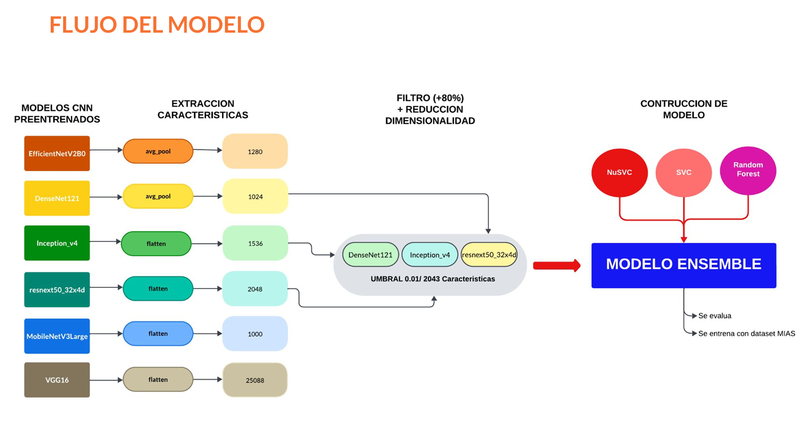

# **ANALISIS Y CLASFICICACION DE IMAGENES DE MAMOGRAFIA CON MODELOS PREENTRENADOS - VERSION_1**

## **DESCRIPCION**

Según la Organización Mundial de la Salud (OMS), el cáncer de mama es el segundo cáncer más diagnosticado en mujeres en todo el mundo.

Este proyecto busca aportar a la investigación en el área de **detección y clasificación de imágenes de mamografía**, explorando modelos de **aprendizaje profundo** para mejorar la clasificación de imágenes médicas.  
Se procesó el conjunto de datos MIAS, aplicando técnicas de data augmentation y extrayendo características de seis modelos preentrenados.  
A través de la métrica de Información Mutua, se seleccionaron los tres modelos con mejor rendimiento (*f1-score > 80%*).  
Finalmente, se implementó un Model Ensemble con clasificadores tradicionales, donde la inclusión de Random Forest mejoró el rendimiento y redujo el overfitting.  

---

## **INSTRUCCIONES DEL PROYECTO**

### 1️⃣ Exploración y Preprocesamiento de Datos [`1_eda_pdf_mias`]  
- Se utilizó el conjunto de datos **MIAS**, que contiene **322 imágenes de mamografía** en formato de **rayos X** con una resolución estándar de **1024x1024 píxeles**.  
- Se cuenta con un **documento PDF** con detalles sobre las características de cada imagen.  
- Se evaluó el modelo según el sistema de clasificación internacional **BI-RADS** y se realizó una **interpretación basada en investigación**.  

### 2️⃣ Visualización y Aumento de Datos [`2_visualizacion`]
- Para mejorar el **balance de clases** y aumentar la cantidad de imágenes disponibles, se aplicaron técnicas de **data augmentation**.  
- Se analizaron los resultados y se visualizó la distribución de los datos.  

### 3️⃣ Extracción de Características con Modelos Preentrenados [`3_features_extraction`]
Se seleccionaron **seis modelos preentrenados** para extraer características de la **capa de aplanamiento** (*flatten layer*):  
- **DenseNet121**  
- **EfficientNetV2B0**  
- **Inception_v4**  
- **MobileNetV3Large**  
- **ResNeXt50_32x4d**  
- **VGG16**  

✔ Se aplicó la métrica de **Información Mutua** y se evaluaron distintos **umbrales de selección**:  
`[0.01, 0.02, 0.03, 0.05, 0.06, 0.1]`  

✔ Se utilizó **LazyPredict** para obtener una **comparación rápida** de métricas.  

✔ Finalmente, se guardaron las **características extraídas** de cada modelo.  

### 4️⃣ Selección de los Mejores Modelos [`4_extraccion_seleccion_conc_3modelos`]  
Para **optimizar las métricas**, se seleccionaron únicamente las características con **información mutua dentro de los umbrales óptimos**.  

✔ Se eligieron **tres modelos** con **f1-score superior al 80%**:  
- **DenseNet121**  
- **Inception_v4**  
- **ResNeXt50_32x4d**  

### 5️⃣ Construcción de un Model Ensemble [`5_modelo_cancer_mama`]  
A partir de los **tres mejores modelos**, se construyó un **Model Ensemble** utilizando **tres clasificadores de Machine Learning**:  
- **SVC**  
- **NuSVC**  
- **Random Forest**  

✔ Se observó que **SVC tenía tendencia al overfitting**, por lo que **Random Forest** fue el **más adecuado** dentro de la combinación final.  




---

## **ESTRUCTURA DEL PROYECTO** 

```plaintext
📂 v1_breast_cancer_m
│── 📁 code
│── 📁 EDA
│── 📁 images
│── 📄 presentacion.pdf
│── 📄 README.md
│── 📄 requirements.txt
